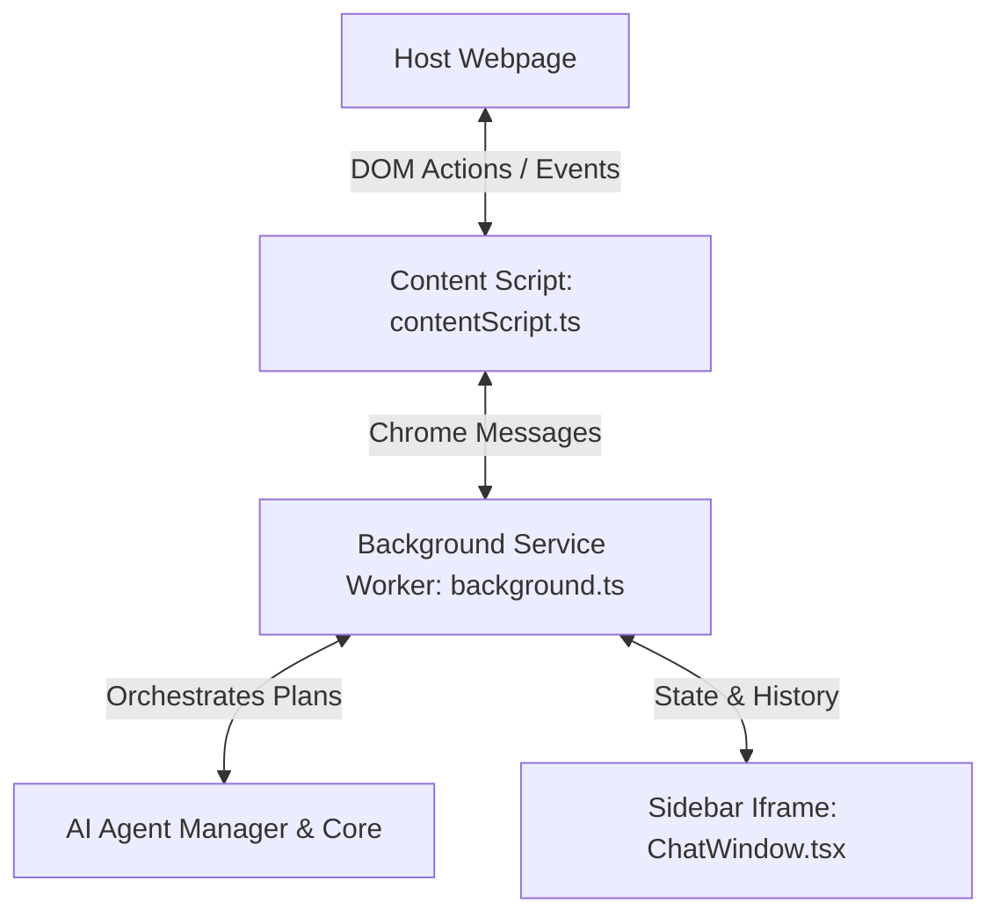

# HUNTERR — The Agentic Web Assistant

HUNTERR is an open-source, private-by-design Chrome Manifest V3 extension that automates complex browser workflows. In addition to a comprehensive **Job Application Suite** (autofilling forms, matching resume PDFs, drafting cover letters), Hunter features specialized agents for **Web Research** (competitors, metrics), **Document Analysis** (summarizing invoices and contracts), **e-Commerce Shopping** (discounts, details), **Travel Planning**, and **Email Drafting** — all running fully local via your own API keys.

---

## Security & Privacy Architecture (Zero-Trust Design)

HUNTERR is built from the ground up to guarantee complete data sovereignty. Since job applications contain highly personal information (resumes, contact details) and require private API keys, the extension implements a strict zero-trust sandbox:

1. **Local-Only Storage**: All user settings, profile details, resume content, and chat history are saved securely inside your browser's private container using `chrome.storage.sync` and `chrome.storage.local`. No external server ever stores or tracks your profile.
2. **Direct Client-to-LLM Connections**: API keys are never sent to a middleman proxy or database. All requests to AI models (Google Gemini, OpenAI, Claude, Groq, OpenRouter, DeepSeek, and Ollama) are made directly from the extension's background worker to the official API endpoints or local services.
3. **API Key Obfuscation**: To protect sensitive credentials saved in sync storage, all API keys are obfuscated and stored encrypted using a key-based XOR and Base64 cipher, and decrypted only in-memory when constructing the provider clients.
4. **Double Isolation Sandbox**: The chat panel UI runs inside a sandboxed `iframe` served from `chrome-extension://` sources, embedded inside a custom-element Web Component (`ai-job-agent`) with an **isolated Shadow DOM**. Due to browser **Same-Origin Policy (SOP)**, scripts running on the host job-board webpage (e.g. LinkedIn or greenhouse.io) cannot read the iframe's DOM, inspect inputs, or steal your resume details or API keys.
5. **Client-Side PDF Parsing**: Resume uploads are parsed locally inside the extension sandbox using `PDF.js`. Your CV is never sent to a document parsing server.
6. **Least-Privilege Model**: Only requests permissions absolutely necessary for automation (`activeTab`, `storage`, `tabs`, `scripting`).

---

## Architecture and Working Principle



### 1. Content Script (`src/content/contentScript.ts`)
- Automatically injected into active tabs.
- Mounts the root custom element `ai-job-agent` on the webpage document.
- Houses a shadow DOM with the floating toggle button and a resizeable sidebar panel.
- Integrates the `iframe` that loads `sidebar.html` inside the shadow root to prevent the host webpage's styles from corrupting the extension UI.
- Executes page-level automation actions (clicking elements, filling inputs, extracting text, uploading resumes) received from the background script.

### 2. Background Service Worker (`src/background/background.ts`)
- Serves as the central state hub and communication bridge.
- Listens to background events and coordinates message passing between the React sidebar UI and the content scripts.
- Orchestrates multi-agent execution flows via the AI planning services.
- Manages progressive token streaming from the AI providers to the sidebar UI.

### 3. Sidebar Chat Interface (`src/sidebar/ChatWindow.tsx`)
- Renders inside the sandboxed iframe.
- Connects directly to local storage to load configuration settings, chat logs, and resume details.
- Handles light/dark theme variables and user chat prompt submissions.

### 4. AI Provider Abstraction Layer (`src/ai/`)
To prevent direct lock-in with any specific provider, Hunter routes all AI queries (chat, streaming, vision, and embeddings) through a provider-agnostic core orchestrator:
- **AI Manager (`src/ai/core/AIManager.ts`)**: Decouples the extension from direct provider APIs, executing requests with dynamic 5-level routing fallbacks (Primary Retry -> Configured Fallback -> Alternative Dynamic Fallback).
- **Capability Registry (`src/ai/core/CapabilityRegistry.ts`)**: Maintains capabilities mapping (e.g. streaming, vision, embeddings, function calling) for each provider, ensuring requests are only sent to supported endpoints.
- **Provider Health Tracker (`src/ai/core/ProviderHealth.ts`)**: Logs provider performance stats (average latency rolling average, total token counts, rate limits, and estimated API usage costs) and triggers automatic offline state routing when threshold failures occur.
- **Prompt Manager (`src/ai/core/PromptManager.ts`)**: Centralizes all structured prompting templates (planner, reasoning engine, cover letter agent, resume parser, visual coordinate locator).
- **Provider Plugins (`src/ai/providers/`)**: Pluggable client drivers for:
  - Google Gemini (`GeminiProvider.ts`)
  - OpenAI (`OpenAIProvider.ts`)
  - Anthropic Claude (`ClaudeProvider.ts`)
  - Groq (`GroqProvider.ts`)
  - OpenRouter (`OpenRouterProvider.ts`)
  - DeepSeek (`DeepSeekProvider.ts`)
  - Ollama (`OllamaProvider.ts`) - local LLM service tracking cost as $0.00.

### 5. AI Agent Core (`src/agents/` / reasoning)
- **Planner (`planner.ts`)**: Decodes user requests (e.g. "autofill form", "generate cover letter") into structured agent execution steps.
- **Executor (`executor.ts`)**: Drives the manager to guide specific agents through sequential steps.
- **Specialized Agents**:
  - **JobAgent**: Parses job descriptions and extracts structured details (role title, location, salary).
  - **ResumeAgent**: Parses resume text details and formats user profile metrics.
  - **MatchAgent**: Computes match scores and maps skills (matched and missing).
  - **FormAgent**: Maps parsed profile details against scanned form inputs.
  - **ResearchAgent**: Queries company data to enrich the application context.
  - **VisionAgent**: Orchestrates visual screenshot analysis, locates visual fields, and executes coordinate-based clicking and typing.

---

## Vision Runtime & Visual Perception

HUNTERR incorporates an advanced **Vision Runtime** designed to enable full page automation even when webpage DOM elements are custom-rendered (e.g. Canvas inputs, custom style checkboxes) or obfuscated.

- **Low DOM Confidence Fallback**: When DOM parsing yields low confidence (content matches < 300 characters), the **ReasoningEngine** automatically switches selectors to vision equivalent tools (`vision_click`, `vision_fill`, `vision_analyze`).
- **Multimodal Visual Capturing**: Compresses screenshots to 80% JPEG quality and applies simple TTL caches to minimize Gemini/OpenAI Vision API calls.
- **Intersection-over-Union (IoU) Locator**: Matches normalized coordinate maps `[0-1000]` returned by AI Vision to active DOM elements using viewport pixel ratios and center proximity scores.
- **Visual Actions Overlay**: Highlights the target element with a glowing dashed border box, displays its name and confidence score, and prompts for confirmation before execution.
- **Developer mode logs**: Captures active screenshots, elements bounding boxes, chosen targets, and visual memory interactions inside the console.

---

## Tech Stack

- **Framework**: React 18, TypeScript, Tailwind CSS v3
- **UI Architecture**: Standardized Shadcn/UI design conventions leveraging CVA (Class Variance Authority) and Radix primitives (Slot, Tooltip, Dialog, Dropdown Menu).
- **Design System & Theme**: Dynamic CSS variable-based semantic theme system supporting full light/dark modes with a premium cybernetic gradient accent (electric indigo `#6366f1` to deep violet `#8b5cf6` and pink `#d946ef`) and high-contrast surface layers.
- **Iconography**: Structured scale icon system using Lucide React (14px inline/action, 16px nav/header, 20px empty states/banners).
- **Build Tool**: Vite (configured for bundle splitting extension assets and content script bundling)
- **APIs**: Chrome Extension Manifest V3 (Background Service Workers, Content Script Injection, Chrome Storage API)
- **AI Integrations**: Direct client-side calls routed through `AIManager` using user-supplied API keys (XOR obfuscated) or local service endpoints (such as Ollama).

---

## Setup and Installation

### 1. Prerequisites
Install Node.js (LTS recommended) on your machine. Note that since the workspace contains package-level script parameters, you should install dependencies using the pnpm package manager. If pnpm is not installed globally, you can execute it via npx.

### 2. Install Dependencies
Clone the repository and install packages:
```bash
git clone https://github.com/pandeYtushal/Hunter.git
cd Hunter
npx pnpm install
```

### 3. Build the Extension
To compile the extension:
```bash
npx pnpm build
```
This outputs compiled files in the dist directory.

### 4. Load the Extension in Chrome
1. Open Google Chrome and navigate to chrome://extensions/
2. Enable Developer mode using the toggle in the top-right corner.
3. Click Load unpacked in the top-left corner.
4. Select the dist folder generated inside your project directory.

---

## Usage Guide

Follow these steps to configure and use HUNTERR for job search automation.

### Step 1: Configure Your AI API Keys
To maintain absolute privacy, HUNTERR connects directly to your chosen AI provider without intermediate proxy servers.
1. Click the HUNTERR extension icon in your Chrome toolbar to open the popup interface.
2. Click the API Config option in the bottom-right corner of the popup.
3. Select your preferred AI Provider from the dropdown list.
4. Paste your API key in the input box. Your keys are saved locally and securely inside the browser's storage container.

### Step 2: Configure Your Profile and Resume
1. Navigate to a standard website (such as google.com or github.com).
2. Open the HUNTERR sidebar by clicking the floating circular toggle button on the right edge of the screen, or by clicking Open AI Chat in the toolbar popup.
3. Click the Profile Settings button (user icon) at the top of the sidebar.
4. Drag and drop your resume in PDF format into the upload card, or click to select the file.
5. The local parser will extract the text, send it to the local LLM wrapper to parse your details, and populate your name, email, phone, and skills.
6. Verify and edit your details manually if needed, then click Save Profile.

### Step 3: Analyze Job Postings
1. Navigate to a job description page (such as Greenhouse, Lever, LinkedIn, or Indeed).
2. Open the HUNTERR sidebar.
3. Click any of the quick-action prompts at the bottom:
   - Summarize page: Provides a quick overview of the job posting.
   - Extract job details: Extracts structured information such as role title, location, salary range, and experience.
   - Match: Evaluates your resume against the job requirements, returns a match score, highlights matched skills, and identifies missing skills.

### Step 4: Run the Autofill Agent
1. Open a job application form page.
2. In the HUNTERR sidebar, click the Run Autofill Agent button.
3. The FormAgent scans all input fields and selects the correct value from your saved profile details.
4. An Autofill Form Confirmation card will appear in your chat window showing proposed mapping values.
5. Review the values, then click Confirm Fill.
6. The fields on the webpage will populate and highlight in green. Note that for security, browser sandboxing prevents scripts from setting file fields, so resume upload fields will be highlighted in blue for manual upload.

---

## License

This project is licensed under the MIT License.
