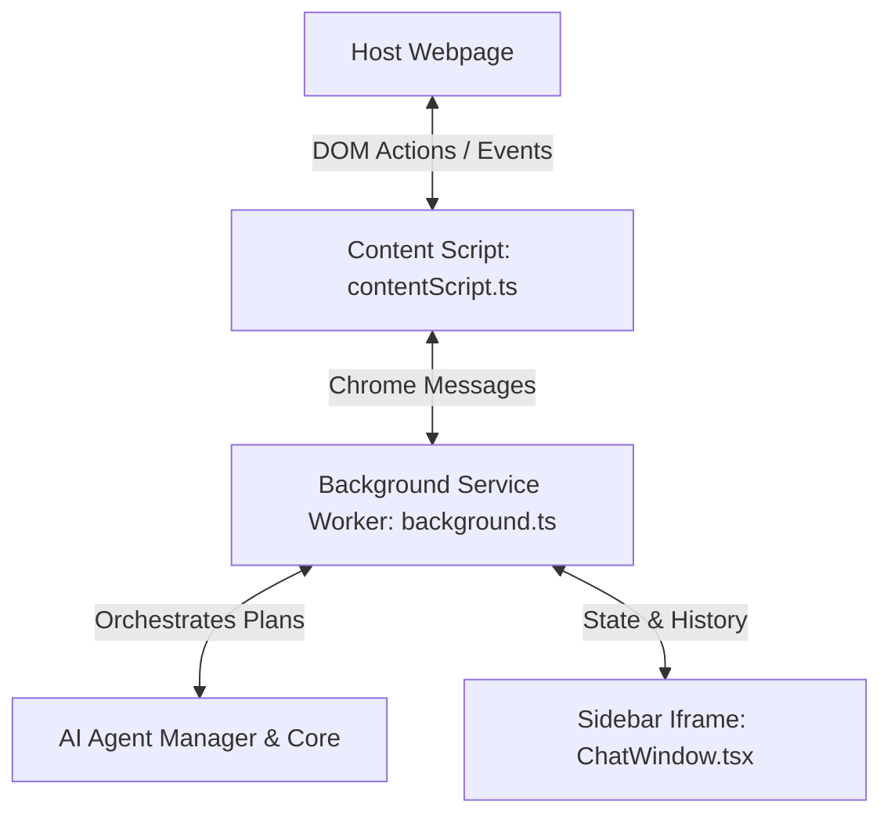

# HUNTERR — The Agentic Job Application Assistant

HUNTERR is an open-source, private-by-design Chrome Manifest V3 extension that automates and streamlines your job search process. It injects a floating chat sidebar onto active webpages, enabling you to analyze job descriptions, evaluate skills match against your resume, draft tailored cover letters, and perform automated form autofill actions.

---

## Security & Privacy Architecture (Zero-Trust Design)

HUNTERR is built from the ground up to guarantee complete data sovereignty. Since job applications contain highly personal information (resumes, contact details) and require private API keys, the extension implements a strict zero-trust sandbox:

1. **Local-Only Storage**: All user settings, profile details, resume content, and chat history are saved securely inside your browser's private container using `chrome.storage.sync` and `chrome.storage.local`. No external server ever stores or tracks your profile.
2. **Direct Client-to-LLM Connections**: API keys are never sent to a middleman proxy or database. All requests to AI models (Google Gemini, OpenAI, Claude, and Groq) are made directly from the extension's background worker to the official API endpoints:
   - `generativelanguage.googleapis.com` (Google)
   - `api.openai.com` (OpenAI)
   - `api.anthropic.com` (Anthropic)
   - `api.groq.com` (Groq)
3. **Double Isolation Sandbox**: The chat panel UI runs inside a sandboxed `iframe` served from `chrome-extension://` sources, embedded inside a custom-element Web Component (`ai-job-agent`) with an **isolated Shadow DOM**. Due to browser **Same-Origin Policy (SOP)**, scripts running on the host job-board webpage (e.g. LinkedIn or greenhouse.io) cannot read the iframe's DOM, inspect inputs, or steal your resume details or API keys.
4. **Client-Side PDF Parsing**: Resume uploads are parsed locally inside the extension sandbox using `PDF.js`. Your CV is never sent to a document parsing server.
5. **Least-Privilege Model**: Only requests permissions absolutely necessary for automation (`activeTab`, `storage`, `tabs`, `scripting`).

---

## Architecture and Working Principle

The extension operates via three main components working together:



### 1. Content Script (`src/content/contentScript.ts`)
- Automatically injected into active tabs.
- Mounts the root custom element `ai-job-agent` on the webpage document.
- Houses a shadow DOM with the floating toggle button and a resizeable sidebar panel.
- Integrates the `iframe` that loads `sidebar.html` inside the shadow root to prevent the host webpage's styles from corrupting the extension UI.
- Executes page-level automation actions (clicking elements, filling inputs, extracting text, uploading resumes) received from the background script.

### 2. Background Service Worker (`src/background/background.ts`)
- Serves as the central state hub and communication bridge.
- Listens to background events and coordinates message passing between the React sidebar UI and the content scripts.
- Orchestrates multi-agent execution flows via the AI planning services.

### 3. Sidebar Chat Interface (`src/sidebar/ChatWindow.tsx`)
- Renders inside the sandboxed iframe.
- Connects directly to local storage to load configuration settings, chat logs, and resume details.
- Handles light/dark theme variables and user chat prompt submissions.

### 4. AI Agent Core (`src/ai/` and `src/agents/`)
- **Planner (`planner.ts`)**: Decodes user requests (e.g. "autofill form", "generate cover letter") into structured agent execution steps.
- **Executor (`executor.ts`)**: Drives the manager to guide specific agents through sequential steps.
- **Specialized Agents**:
  - **JobAgent**: Parses job descriptions and extracts structured details (role title, location, salary).
  - **ResumeAgent**: Parses resume text details and formats user profile metrics.
  - **MatchAgent**: Computes match scores and maps skills (matched and missing).
  - **FormAgent**: Maps parsed profile details against scanned form inputs.
  - **ResearchAgent**: Queries company data to enrich the application context.

---

## Tech Stack

- **Framework**: React 18, TypeScript, Tailwind CSS v3
- **Build Tool**: Vite (configured for bundle splitting extension assets)
- **APIs**: Chrome Extension Manifest V3 (Background Service Workers, Content Script Injection, Chrome Storage API)
- **AI Integrations**: Direct client-side fetch calls using user-supplied API keys (no middleware servers needed)

---

## Setup and Installation

### 1. Prerequisites
Install Node.js (LTS recommended) on your machine. This project utilizes `pnpm` as the package manager.

### 2. Install Dependencies
Clone the repository and install packages:
```bash
git clone https://github.com/your-username/hunterr.git
cd hunterr
pnpm install
```

### 3. Build the Extension
To compile the production-ready build:
```bash
pnpm build
```
This outputs compiled assets in the `dist` directory.

### 4. Load the Extension in Chrome
1. Open Google Chrome and go to `chrome://extensions/`.
2. Enable **Developer mode** via the toggle in the top-right corner.
3. Click **Load unpacked** in the top-left corner.
4. Select the `dist` folder generated inside your project directory.

---

## API Configuration

HUNTERR runs client-side using direct API connections to maintain data privacy. 

1. Click the HUNTERR extension icon in your Chrome toolbar.
2. Select **API Config** (or click Setup).
3. Select your provider in the dropdown:
   - Google Gemini (uses gemini-2.5-flash)
   - OpenAI (uses gpt-4o-mini)
   - Anthropic Claude (uses claude-3-5-sonnet)
   - Groq Llama 3 (uses llama-3.3-70b)
4. Enter your API Key. Key values are saved securely in your Chrome sync profile.

---

## License

This project is licensed under the MIT License.
